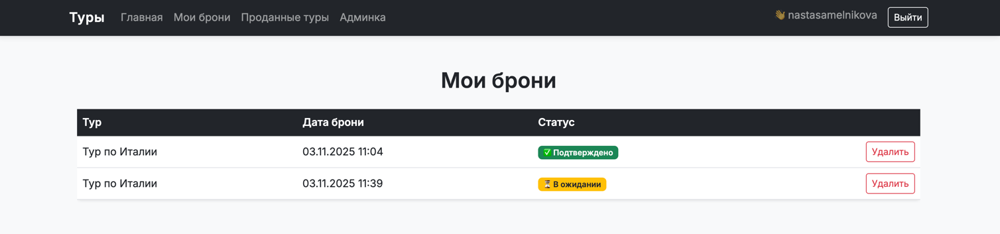
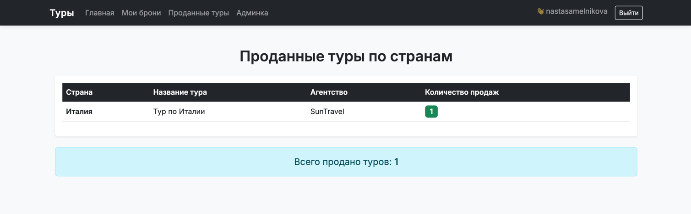

# Лабораторная работа №2: РЕАЛИЗАЦИЯ ПРОСТОГО САЙТА СРЕДСТВАМИ DJANGO

**Вариант №4 — “Список туров туристической фирмы”**

---

## Цель работы
овладеть практическими навыками и умениями реализации web-сервисов
средствами Django 2.2  

Создать сайт туристической фирмы, позволяющий пользователям:

1. регистрироваться и авторизовываться,
2. просматривать туры,
3. бронировать туры и управлять своими бронями,
4. оставлять отзывы с рейтингом (1–10),
5. просматривать статистику проданных туров по странам.
#  Cтруктура проекта

```markdown
tour_agency/
├── manage.py
├── tour_agency/
│ ├── settings.py
│ ├── urls.py
│ ├── wsgi.py
│ └── asgi.py
└── tours/
├── admin.py
├── apps.py
├── models.py
├── views.py
├── urls.py
├── templates/
│ └── tours/
│ ├── base.html
│ ├── tour_list.html
│ ├── my_reservations.html
│ ├── add_review.html
│ ├── tour_detail.html
│ └── sold_tours.html
└── migrations/
└── 0001_initial.py
```
### 1. Создание и настройка проекта
1. Установлено виртуальное окружение и необходимые пакеты:
   ```bash
   pip install django psycopg2-binary bootstrap5 mkdocs
   ```
2. Создан проект:

```bash
django-admin startproject tour_agency
python manage.py startapp tours
```
Добавлено приложение tours в INSTALLED_APPS и настроено подключение к PostgreSQL:

```python
DATABASES = {
    'default': {
        'ENGINE': 'django.db.backends.postgresql',
        'NAME': 'tour_db',
        'USER': 'postgres',
        'PASSWORD': '123',
        'HOST': 'localhost',
        'PORT': '5432',
    }
}
```
### Вывод:
Базовая структура Django-проекта создана, связь с PostgreSQL установлена.

### 2. Моделирование данных
Определены три модели:
```python
class Tour(models.Model):
    name = models.CharField(max_length=100)
    agency = models.CharField(max_length=100)
    country = models.CharField(max_length=100, default='')
    description = models.TextField()
    start_date = models.DateField()
    end_date = models.DateField()
    payment_terms = models.TextField()

    def __str__(self):
        return self.name


class Reservation(models.Model):
    user = models.ForeignKey(User, on_delete=models.CASCADE)
    tour = models.ForeignKey(Tour, on_delete=models.CASCADE)
    reserved_on = models.DateTimeField(auto_now_add=True)
    confirmed = models.BooleanField(default=False)

    def __str__(self):
        return f"{self.user.username} → {self.tour.name}"


class Review(models.Model):
    tour = models.ForeignKey(Tour, on_delete=models.CASCADE)
    user = models.ForeignKey(User, on_delete=models.CASCADE)
    comment = models.TextField()
    rating = models.IntegerField(default=5)
    date_posted = models.DateTimeField(auto_now_add=True)

    def __str__(self):
        return f"{self.tour.name} ({self.rating}/10)"
```        

### Вывод:
Созданы взаимосвязанные модели, реализующие основные сущности предметной области:
тур, бронирование и отзыв. Связи построены по принципу “один-ко-многим” через ForeignKey.

### 3. Настройка маршрутов (urls.py)

Созданы пути для всех функций приложения:
```python
urlpatterns = [
    path('', views.tour_list, name='tour_list'),
    path('register/', views.register, name='register'),
    path('login/', auth_views.LoginView.as_view(template_name='tours/login.html'), name='login'),
    path('logout/', auth_views.LogoutView.as_view(next_page='/'), name='logout'),
    path('reserve/<int:tour_id>/', views.reserve_tour, name='reserve_tour'),
    path('my_reservations/', views.my_reservations, name='my_reservations'),
    path('delete_reservation/<int:res_id>/', views.delete_reservation, name='delete_reservation'),
    path('tour/<int:tour_id>/', views.tour_detail, name='tour_detail'),
    path('review/<int:tour_id>/', views.add_review, name='add_review'),
    path('sold_tours/', views.sold_tours, name='sold_tours'),
]
```
### Вывод:
Маршрутизация реализована в соответствии с архитектурой MVC — каждая страница приложения обрабатывается отдельным view-функцией.

### 4. Реализация представлений (views.py)

**tour_list** — отображает все туры.

**register, login, logout** — регистрация и аутентификация пользователей.

**reserve_tour, my_reservations, delete_reservation** — операции с бронированиями.

**add_review, tour_detail** — добавление и просмотр отзывов.

**sold_tours** — аналитика продаж по странам.

### 5. Шаблоны и дизайн

Для клиентской части использован Bootstrap 5.
Создана базовая структура шаблонов:
```markdown
base.html – общая навигация
tour_list.html – список туров
my_reservations.html – личные брони
tour_detail.html – описание тура + отзывы
add_review.html – форма добавления отзыва
sold_tours.html – таблица проданных туров
```
### 6. Админ-панель Django

Добавлены модели Tour, Reservation, Review.

Администратор подтверждает бронирования через флаг Confirmed.


### Вывод:
Админ-интерфейс полностью функционален и позволяет управлять всеми данными без прямого доступа к БД.

### 7. Реализация аналитической таблицы

Создан метод sold_tours:
```python
def sold_tours(request):
    data = (
        Reservation.objects.filter(confirmed=True)
        .values('tour__country', 'tour__name', 'tour__agency')
        .annotate(sold_count=Count('id'))
        .order_by('tour__country')
    )
    return render(request, 'tours/sold_tours.html', {'data': data})
```
### Вывод:
Собирается статистика по странам и турам.
Подтверждённые бронирования отображаются в виде таблицы с количеством продаж.

### 8. Тестирование работы сайта
| Проверяемый функционал | Результат                       |
| ---------------------- | ------------------------------- |
| Регистрация и вход     |  Успешно                        |
| Просмотр туров         |  Отображаются все туры          |
| Бронирование           |  Создаётся запись в БД          |
| Подтверждение админом  |  Статус меняется на “Подтверждено” |
| Удаление брони         |  Успешно                        |
| Добавление отзывов     |  Отображаются с именем и рейтингом |
| Таблица продаж         |  Работает и сортируется по странам |

### Примеры экранов интерфейса

Главная страница (список туров):


Личные брони:


Описание тура с отзывами:


Проданные туры по странам:


### Общий вывод

В результате выполнения лабораторной работы было создано полноценное веб-приложение туристической фирмы на фреймворке Django с использованием базы данных PostgreSQL.
Система реализует все основные функции, указанные в задании:

- регистрация и авторизация пользователей;
- просмотр и бронирование туров;
- редактирование и удаление собственных бронирований;
- добавление отзывов и выставление рейтингов;
- подтверждение бронирований администратором через встроенную панель Django-admin;
- формирование таблицы проданных туров по странам.

В ходе работы были закреплены практические навыки:

- проектирования моделей данных и связей между ними;
- использования ORM Django для взаимодействия с базой данных;
- построения маршрутов и шаблонов;
- организации клиентского интерфейса с помощью Bootstrap 5;
- работы с админ-панелью и системой аутентификации пользователей.

Итоговый продукт имеет понятный интерфейс, чёткую структуру и легко расширяется.
